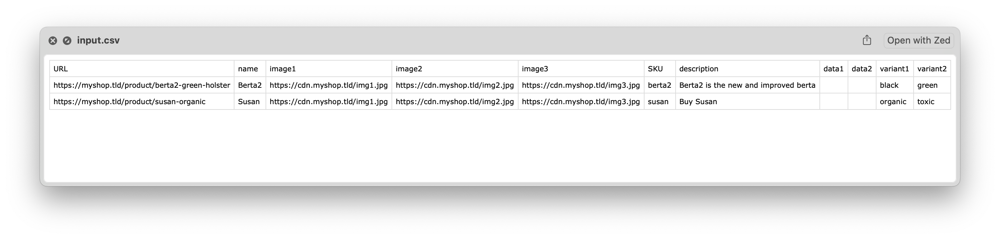
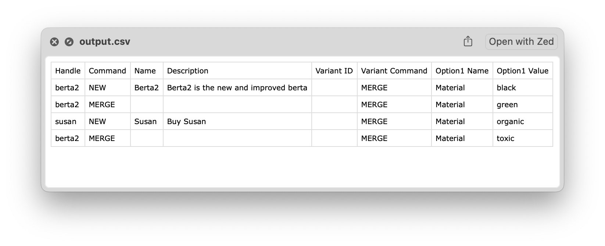
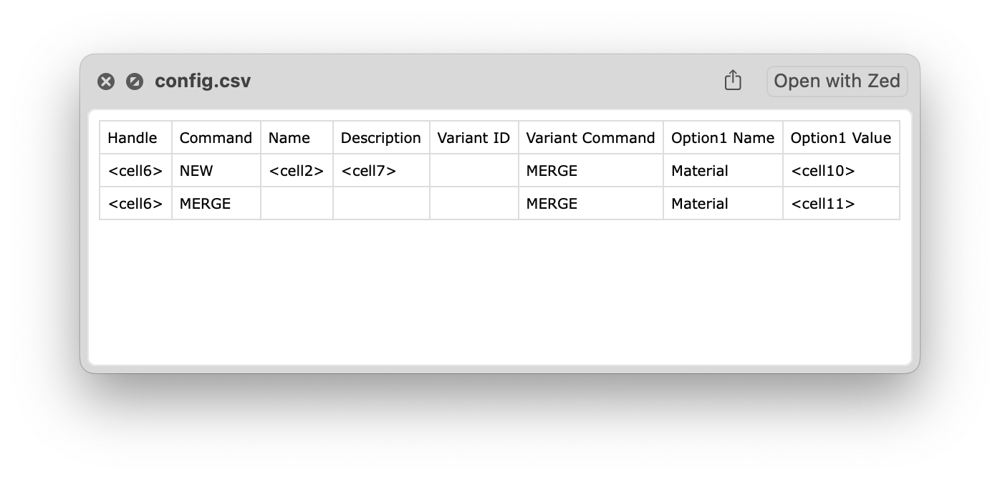

```
█▀▀ █▀▀ █ █   ▀█▀ █▀█   █▀▄▀█ ▄▀█ ▀█▀ █▀█ █ ▀▄▀ █ █▀▀ █▄█
█▄▄ ▄▄█ ▀▄▀    █  █▄█   █ ▀ █ █▀█  █  █▀▄ █ █ █ █ █▀   █
```
A tool to build a matrixify compatible CSV

## Description

`csv2matrixify` is a Rust-based CLI application designed to convert CSV files into a format compatible with
[Matrixify](https://matrixify.app/), a powerful import/export app for Shopify stores.
This tool streamlines the process of preparing bulk data for Shopify, making it easier to manage large inventories.

## Features

- **Easy Conversion**: Transform standard CSV files into Matrixify-compatible CSVs with a config file easily written with any spreadsheet processor.
- **Fast Processing**: Leverages Rust's performance to handle *very* large files efficiently.
- **No dependencies**: This app uses no external crates.

## How does it work?

Imagine you scrape a website with your favorite scraper and now have this huge spreadsheet with a lot of data.

<details>
<summary>View the code</summary>

```csv
URL,name,image1,image2,image3,SKU,description,data1,data2,variant1,variant2
https://myshop.tld/product/berta2-green-holster,Berta2,https://cdn.myshop.tld/img1.jpg,https://cdn.myshop.tld/img2.jpg,https://cdn.myshop.tld/img3.jpg,berta2,Berta2 is the new and improved berta,,,black,green
https://myshop.tld/product/susan-organic,Susan,https://cdn.myshop.tld/img1.jpg,https://cdn.myshop.tld/img2.jpg,https://cdn.myshop.tld/img3.jpg,susan,Buy Susan,,,organic,toxic
```
</details>

These spreadsheet can be very large and contain many cells that you may not even need.
Others need to be reshuffled or split into it's own line etc.

A good matrixify spreadsheet for the above data could be this sheet:

<details>
<summary>View the code</summary>

```csv
Handle,Command,Name,Description,Variant ID,Variant Command,Option1 Name,Option1 Value
berta2,NEW,Berta2,Berta2 is the new and improved berta,,MERGE,Material,black
berta2,MERGE,,,,MERGE,Material,green
susan,NEW,Susan,Buy Susan,,MERGE,Material,organic
berta2,MERGE,,,,MERGE,Material,toxic
```
</details>

You have to split off each line into two and make sure you select the right items with the right headlines.

With `csv2matrixify` you can do this by creating a config spreadsheet like this:

<details>
<summary>View the code</summary>

```csv
Handle,Command,Name,Description,Variant ID,Variant Command,Option1 Name,Option1 Value
<cell6>,NEW,<cell2>,<cell7>,,MERGE,Material,<cell10>
<cell6>,MERGE,,,,MERGE,Material,<cell11>
```
</details>

The first line of the config is the heading you like.
No changes will be made to it.

All lines after are free for you to allocate.
You reference cells by using the `<cell[x]>` token.
The reference is pointing to a single line from your import.
Each line from you input csv file will be processed via this config.

```
   ┌────────────────────────────────────────────────────────────┐
   │                         Input.csv                          │
   ├───────┬───────┬───────────┬─────────┬──────────────┬───────┤
   │Heading│Heading│  Heading  │ Heading │   Heading    │Heading│
   ├───────┼───────┼───────────┼─────────┼──────────────┼───────┤
   │<cell1>│<cell2>│  <cell3>  │ <cell4> │   <cell5>    │<cell6>│
   ├───────┼───────┼───────────┼─────────┼──────────────┼───────┤
   │  ...  │  ...  │    ...    │   ...   │     ...      │  ...  │
   ├───────┼───────┼───────────┼─────────┼──────────────┼───────┤
   │  ...  │  ...  │    ...    │   ...   │     ...      │  ...  │
   ├───────┼───────┼───────────┼─────────┼──────────────┼───────┤
   │  ...  │  ...  │    ...    │   ...   │     ...      │  ...  │
   └───────┴───────┴───────────┴─────────┴──────────────┴───────┘
                                 │
                                 │
                                 ▼
┌───────────────────────────────────────────────────────────────────┐
│                            Config.csv                             │
├───────┬───────────┬─────────┬──────────────┬───────┬──────────────┤
│Heading│  Heading  │ Heading │   Heading    │Heading│   Heading    │
├───────┼───────────┼─────────┼──────────────┼───────┼──────────────┤
│<cell6>│  <cell3>  │  MERGE  │   <cell5>    │<cell1>│ https://...  │
├───────┼───────────┼─────────┼──────────────┼───────┼──────────────┤
│<cell6>│  <cell4>  │   NEW   │              │<cell2>│ https://...  │
└───────┴───────────┴─────────┴──────────────┴───────┴──────────────┘
                                 │
                                 │
                                 ▼
┌───────────────────────────────────────────────────────────────────┐
│                            Output.csv                             │
├───────┬───────────┬─────────┬──────────────┬───────┬──────────────┤
│Heading│  Heading  │ Heading │   Heading    │Heading│   Heading    │
├───────┼───────────┼─────────┼──────────────┼───────┼──────────────┤
│  ...  │    ...    │  MERGE  │     ...      │  ...  │ https://...  │
├───────┼───────────┼─────────┼──────────────┼───────┼──────────────┤
│  ...  │    ...    │   NEW   │              │  ...  │ https://...  │
├───────┼───────────┼─────────┼──────────────┼───────┼──────────────┤
│  ...  │    ...    │  MERGE  │     ...      │  ...  │ https://...  │
├───────┼───────────┼─────────┼──────────────┼───────┼──────────────┤
│  ...  │    ...    │   NEW   │              │  ...  │ https://...  │
├───────┼───────────┼─────────┼──────────────┼───────┼──────────────┤
│  ...  │    ...    │  MERGE  │     ...      │  ...  │ https://...  │
├───────┼───────────┼─────────┼──────────────┼───────┼──────────────┤
│  ...  │    ...    │   NEW   │              │  ...  │ https://...  │
├───────┼───────────┼─────────┼──────────────┼───────┼──────────────┤
│  ...  │    ...    │  MERGE  │     ...      │  ...  │ https://...  │
├───────┼───────────┼─────────┼──────────────┼───────┼──────────────┤
│  ...  │    ...    │   NEW   │              │  ...  │ https://...  │
├───────┼───────────┼─────────┼──────────────┼───────┼──────────────┤
│  ...  │    ...    │  MERGE  │     ...      │  ...  │ https://...  │
├───────┼───────────┼─────────┼──────────────┼───────┼──────────────┤
│  ...  │    ...    │   NEW   │              │  ...  │ https://...  │
└───────┴───────────┴─────────┴──────────────┴───────┴──────────────┘
```

In this example we're splitting a single input line into two resulting in double the lines in our output file.


## Config reference

The config file includes logic and filters that will make it easier for you to generate smarter outputs.

### Filters

Filters allow you to make changes to the content of a cell.

Syntax: `<cell[n] FILTER|'argument'|[number]>`

TODO: add docs for:
- [ ] `UPPER_CASE`
- [ ] `LOWER_CASE`
- [ ] `SPLIT|','|1`
- [ ] `SUB_STRING|10|5`
- [ ] `REPLACE|' '|'-'`
- [ ] `APPEND|'-end'`
- [ ] `PREPEND|'pre-'`
- [ ] `LENGTH`
- [ ] `TRIM`
- [ ] `TRIM_START`
- [ ] `TRIM_END`

## Conditions

Conditions allow you to add logic to a cell.

Syntax: `:IF <cell1> [condition] ('then-item') [ELSE ('else-item')]`

- The `ELSE` clause is optional
- A `then-item` can be a String or a cell: `:IF <cell1> [condition] ('then-item')` or `:IF <cell1> [condition] (<cell2>)`

_(💡  You can also use it to skip an entire line by adding the `SKIP_LINE` into the `then-item` or `else-item`)_

TODO: add docs for:
- [ ] `IS_EMPTY`
- [ ] `IS_NOT_EMPTY`
- [ ] `IS_NUMERIC`
- [ ] `STARTS_WITH|'beginning'`
- [ ] `ENDS_WITH|'end'`
- [ ] `CONTAINS|'happieness'`
- [ ] `CONTAINS 'happy','`
- [ ] `== 'this item`
- [ ] `!= 'this item`
- [ ] `> 42`
- [ ] `< 42`
- [ ] `% 2 = 0`

## CLI Usage

```sh
csv2matrixify [OPTIONS]

Options:
  -i <file>, --input <file>
        Specify the input file to process.
  -o <file>, --output <file>
        Specify the output file to write results to.
  -c <file>, --config <file>
        Specify the config file to determin what the output format is.
  -v, -V, --version
        Display the program's version information.
  -h, --help
        Display this help message.
```

Example command:

```sh
csv2matrixify -i input.csv -o output.csv -c config.csv
```

## Installation

### Prerequisites

- **Rust**: Ensure you have Rust installed.
You can download it from [rust-lang.org](https://www.rust-lang.org/tools/install).

#### Install via cargo

```sh
cargo install csv2matrixify
```

#### Build from Source

```sh
git clone https://github.com/the-working-party/csv2matrixify.git
cd csv2matrixify
cargo build --release
# Now run the app via "cargo run --release" instead of "csv2matrixify" or locate the binary in your target folder
```

## Contributing

Contributions are welcome.
Please [open an issue](https://github.com/the-working-party/csv2matrixify/issues/new) or
[submit a pull request](https://github.com/the-working-party/csv2matrixify/compare) on the
[GitHub repository](https://github.com/the-working-party/csv2matrixify) to contribute to this project.

## Licensing
Copyleft (c) 2024
Licensed under [MIT](https://raw.githubusercontent.com/the-working-party/csv2matrixify/refs/heads/main/LICENSE?token=GHSAT0AAAAAABO36GVRGUHXFAY4O4AZ6BAQZZSUEGA).
